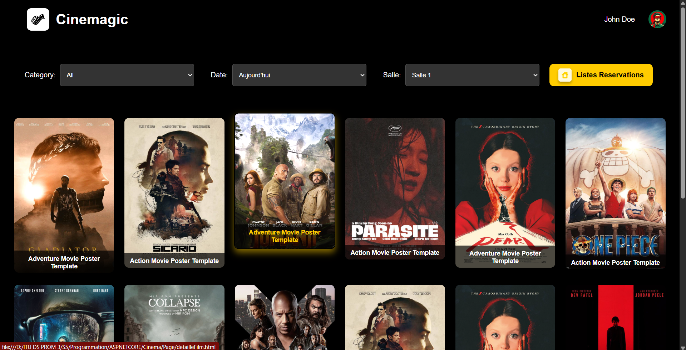

# 🎬 Projet CINÉMA

Ce projet simule la gestion d’un cinéma à l’aide de **C#** et **ASP.NET Core**.

## 🏛️ Structure du cinéma

- Un **cinéma** possède plusieurs **salles**.
- Chaque **salle** contient un ensemble de **places** configurables :
  - Nombre de **colonnes**
  - Nombre de **lignes par colonne**
  - Le **nombre total de places** est automatiquement calculé et affiché.

## 📅 Planification des films

Les responsables peuvent planifier les films avec les informations suivantes :

- 🎞️ **Titre**
- 🕒 **Date et heure** de début et de fin
- ⚠️ **Spécificité** (ex : interdit aux moins de 12/18 ans)
- 🎭 **Catégorie** (Horreur, Humour, etc.)  
  > Les catégories sont stockées dans une table séparée.

## 📽️ Gestion des diffusions

- Chaque salle a :
  - Des **heures d’ouverture**
  - Des **plages de diffusion**
- La **durée du film** est prise en compte pour la planification.

### ✅ Règles à respecter

- Un film **ne peut pas être diffusé en même temps qu’un autre dans la même salle**.
- Il faut **vérifier les créneaux horaires** pour éviter les conflits.
- La diffusion doit se faire **pendant les heures d’ouverture**.

## 🎟️ Réservations

Les spectateurs peuvent **réserver une place** pour une séance.

- La place passe à l’état :
  - 🟢 **Libre**
  - 🟡 **Réservée**
  - 🔴 **Payée**
- ⏱️ Si une place **n’est pas payée dans l’heure**, elle redevient **disponible**.

## 🖼️ Affichage des places

Les états des places sont représentés par un **code couleur** :

- 🟢 **Vert** : libre
- 🟡 **Jaune** : réservée
- 🔴 **Rouge** : payée

## 🛠️ Technologies utilisées

- **Langage** : C#
- **Framework** : ASP.NET Core

### ℹ️ Qu’est-ce que ASP.NET Core ?

- **ASP.NET** : un framework pour développer des applications web avec C#.
- **.NET Core / .NET 5+** : une version moderne et multiplateforme du framework .NET.  
  Idéal pour créer des applications web et cloud performantes.

---

💡 N’hésitez pas à contribuer ou à proposer des améliorations !
